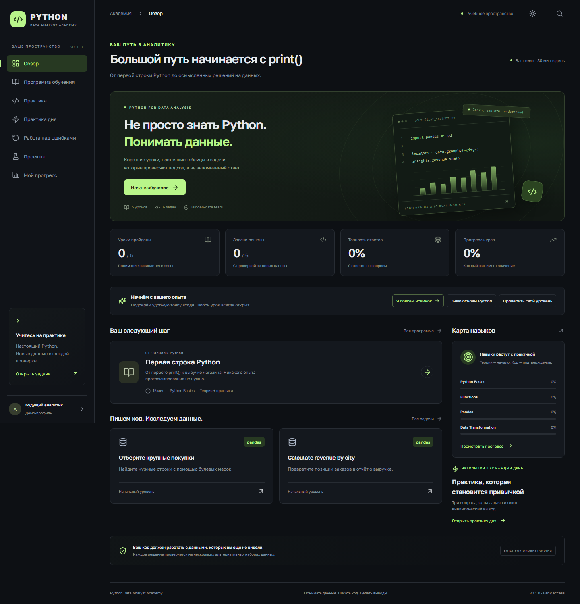
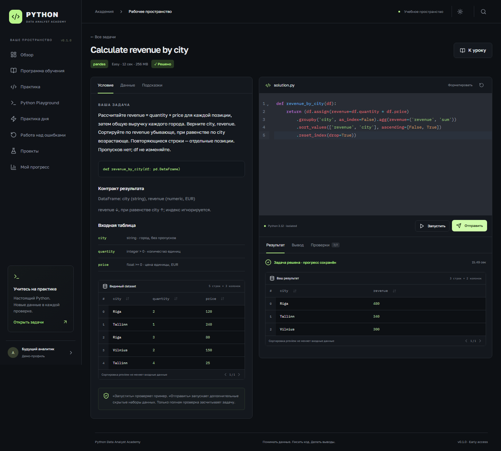

# Python Data Analyst Academy

Learn Python for Data Analysis from zero to Junior — with real datasets, hidden validation and hands-on analytics.

**Status: v0.1 early access.** This is a working first part of that learning path, not a completed Junior curriculum or professional certification. It currently includes **12 Russian lessons, 60 explained questions, 15 executable challenges, 4 downloadable project briefs, and 7 topic review sets**. See [the exact implementation status](docs/project-status.md) before interpreting those counts.



## Overview

A React learning workspace backed by FastAPI: read an explanation, make a mistake, understand why, write real Python and test it against data you have not seen. Demo mode needs no registration. Accounts preserve progress across browsers. A free Python/DataFrame playground supports NumPy, pandas, Matplotlib and Seaborn.

## Why this project

An analyst needs to reason about rows, units, missing values, joins and evidence. Passing a quiz or reproducing one example table does not demonstrate that skill. This academy makes those distinctions visible and never awards a challenge for a sample-only run.

## Your solution must work on data you have never seen

Coding challenges are validated against multiple hidden datasets so solutions cannot depend on example-specific values. The city-revenue demo uses six alternatives: different cities, different row order, one city, decimal prices, duplicate-looking values and a larger table. Tests prove that a hardcoded visible answer passes the sample and fails the submission.

References and verdicts are computed outside the untrusted worker. Hidden input, hidden stdout and hidden expected results are omitted from the learner response. This is educational anti-hardcoding, not secret examination infrastructure: this public repository contains the reproducible fixtures.



## Curriculum

| Area | Available in v0.1 |
|---|---|
| Python | First print, variables, basic types, functions, conditions, collections and error handling; beginner calculation and conversion tasks |
| NumPy | Arrays, masks, vectorized operations, shape/axis, broadcasting and NaN concepts; array task |
| pandas | Table inspection, selection, filtering, sorting, groupby, named aggregation, cleaning; introductory joins and dates |
| Matplotlib | Monthly line-chart task checked on alternative dates; real rendered PNG preview |
| Seaborn | Introductory lesson section and runnable histogram playground example; no dedicated graded Seaborn track yet |
| Statistics | Mean/median, outliers, sampling, ddof, p-value interpretation, absolute/relative uplift; introductory SciPy example |
| SQL | SQLite SELECT/WHERE/GROUP BY/HAVING/ORDER BY; read_sql and parameterization; alternate-database grading |
| Projects | Sales, customers, funnel and multi-table e-commerce; synthetic CSVs, data dictionaries and self-review rubrics |

The full 71-module roadmap, deeper NumPy/pandas/Seaborn/SciPy/API/Excel material, independent exams and final unknown-dataset assessment remain planned. The topic review sets reuse lesson questions and are explicitly not independent examinations.

## Quick start

Install Docker Desktop with Linux containers (or Docker Engine + Compose). No local Python or Node installation is required for this path.

```sh
git clone https://github.com/German4341374/python-data-analyst-academy.git
cd python-data-analyst-academy
docker compose up --build
```

Open **[http://localhost:8080](http://localhost:8080)**. First build downloads Python/Node images and scientific libraries. Compose creates PostgreSQL, the API, Nginx frontend, a private execution broker and the sandbox image. Subsequent learner jobs are disposable containers. The published port binds only to `127.0.0.1`.

On Windows use a checkout path containing ASCII characters. Some Docker Compose/Bake builds reject non-ASCII paths with `x-docker-expose-session-sharedkey`. A directory junction to the same checkout also works; no files need to be moved. WSL 2 must be installed and Docker's Linux engine running.

For a Windows folder with Cyrillic characters, the included launcher creates a checked ASCII junction on the same drive automatically and starts Compose:

```powershell
powershell -NoProfile -ExecutionPolicy Bypass -File .\scripts\start.ps1
```

The execution-policy option applies only to that PowerShell process. The launcher never moves or removes project files.

Default Compose database/broker credentials are **local-development-only**, documented in `.env.example`; there is no shared pre-created account. Each browser receives a separate demo profile. Register an email/password (12+ characters) to keep that profile. `docker compose down` stops services without deleting the database volume.

## Architecture

```text
React + TypeScript + CodeMirror
        ↓ same-origin /api
FastAPI → PostgreSQL (SQLAlchemy / Alembic)
        ↓ authenticated private broker
Docker → fresh non-root Python container per case
        ↓ bounded validated JSON
Trusted reference + comparison → feedback and progress
```

See [architecture](docs/architecture.md), [grading](docs/grading-engine.md), [content format](docs/content-format.md) and [the runner threat model](docs/code-runner-security.md).

## Secure Python runner

Learner containers run as UID 65534, with no network, no host bind mounts, no Docker socket, read-only root, dropped capabilities, no-new-privileges, 1 CPU, 256 MiB RAM/no extra swap, 32 PIDs, a 32 MiB temporary filesystem and per-case time limits. Worker stdout is capped at 8,192 characters; an independent outer collector caps combined output at 512 KiB even if learner code bypasses Python stream wrappers.

The **trusted broker**, not the learner container, has Docker-socket authority. Keep it private. A container shares a kernel with its host; this is not a claim of perfect isolation. Mutation checks within the Python interpreter are educational checks, not tamper-proof attestation. Docker failure never falls back to host execution. Read the threat model before any shared or internet deployment.

## Development

Python 3.12+ and Node 22+:

```sh
python -m venv .venv
# Linux/macOS: source .venv/bin/activate
# Windows PowerShell: .venv\Scripts\Activate.ps1
pip install -e '.[dev,runner]'
alembic upgrade head
docker build -f runner/Dockerfile -t academy-sandbox:0.1.0 .
uvicorn academy.api:app --host 127.0.0.1 --port 8000
```

In another terminal:

```sh
cd frontend
npm ci
npm run dev
```

Open [http://127.0.0.1:5173](http://127.0.0.1:5173). Vite proxies the API. Development uses SQLite `academy.db` unless `DATABASE_URL` is set. It still executes Python only in Docker. Code drafts and project checklists live in browser storage; attempts and course progress live in the database.

## Testing

```sh
python scripts/verify.py          # format, lint, typing, tests, content, frontend build
cd frontend
npx playwright install chromium
cd ..
python scripts/verify.py --full   # additionally Compose build, sandbox/security, E2E
```

`make verify` is the full equivalent. Real execution/security tests are enabled with `RUN_DOCKER_TESTS=1`; they fail rather than skip when explicitly enabled but Docker is unavailable. Ordinary runs explicitly skip them. The GitHub workflow runs full verification plus dependency audits. See [verification results](docs/verification.md) for actual outcomes, not assumed coverage.

## Screenshots

Captured from the real application by Playwright: [roadmap](docs/screenshots/roadmap.png), [lesson](docs/screenshots/lesson.png), [wrong-answer explanation](docs/screenshots/quiz-feedback.png), [DataFrame viewer](docs/screenshots/dataframe-viewer.png), [skill map](docs/screenshots/skill-map.png), [mobile view](docs/screenshots/mobile.png). Plot and project screenshots are captured in the extended smoke suite.

## Security

Local Compose defaults are not an internet hosting configuration. Use a dedicated runner host, reviewed dependency/image pins, TLS with `COOKIE_SECURE=1`, unique secrets, operational quotas, monitoring and stronger examination integrity before shared deployment. No password recovery or email verification is implemented. See [security reporting](SECURITY.md).

## Contributing

Read [CONTRIBUTING.md](CONTRIBUTING.md), the [question-writing guide](docs/question-writing-guide.md) and [dataset-writing guide](docs/dataset-writing-guide.md). Version content changes and test general solutions plus sample-only hardcoded failures. Never add private or unlicensed data.

## Roadmap

1. Expand the reviewed foundations into the complete 71-module sequence.
2. Add varied question types, more challenge contracts, Series/multi-table grading and API/Excel practice.
3. Implement independent timed exams and assessed project submissions.
4. Deliver a final practical assessment on an unseen multi-table dataset with interpretation review.
5. Complete external security/accessibility review and operational hardening before multi-user hosting.

MIT is chosen to make educational reuse and contribution straightforward with a short permissive license. Dependencies keep their own licenses. The application makes no employment guarantee.
