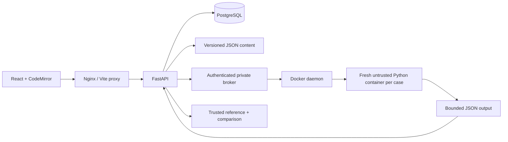

# Architecture

The API owns sessions, attempts and completion records. It never executes learner Python. The broker receives a fixed challenge ID and a case index; it resolves input and resource constraints from trusted repository content. The caller cannot choose an image, mount, Docker option or arbitrary host path. Each sandbox sees one dataset, no expected output, no database credentials, no network and no Docker socket. Reference functions and grading remain outside the sandbox.

In local Python development the API invokes the same Docker launcher directly. This is still container-only execution, not a local subprocess fallback. Compose separates this privileged operation into a broker accessible only on a private network. The broker necessarily has Docker daemon authority; keep it private and run it on a dedicated host/VM before shared deployment.

Educational entities remain in versioned JSON rather than duplicated mutable SQL rows. SQL contains users, hashed session tokens, versioned attempts, completion records and bookmarks. Quiz mistake history and deterministic skill scores are derived from attempts. SQLite is available for local development and tests; PostgreSQL is the Compose default. Alembic owns schema changes.
